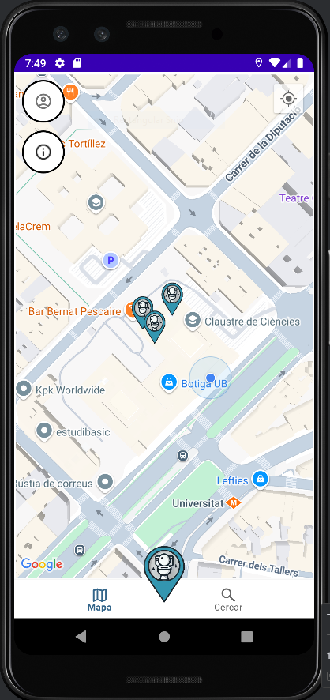

[](https://classroom.github.com/a/flg1PHQO)
# 🌐 CagaUB

CagaUB és una aplicació android desenvolupada per a l'assignatura de Projecte Integrat de Software (PIS) de la Universitat de Barcelona.

Aquesta aplicació està dissenyada per poder trobar el millor lavabo segons les valoracions i la distància amb un mapa interactiu.

Anar al lavabo mai havia estat tan fàcil, uneix-te a la comunitat de caganers!

---

## 📸 Demo



---

## 🚀 Característiques

Amb CagaUB, podràs:

- Afegir els lavabos que volguis.
- Escriure ressenyes i penjar fotos.
- Rebre recomanacions segons la teva ubicació.

---

## 🛠️ Tecnologies utilizades

- Frontend: `AndroidXML`, `Java`
- Backend: `Java`, `Firebase`
- API's: `GoogleMapsAPI`, `Firebase`, `Cloudinary`

---

## 🧪 Com instal·lar i correr el projecte localment

```bash
# Clona el repositorio
https://github.com/ProjecteIntegratDeSoftware-24-25/projecte-antoniu-co.git

# Entra al directorio
cd el-teu-projecte
